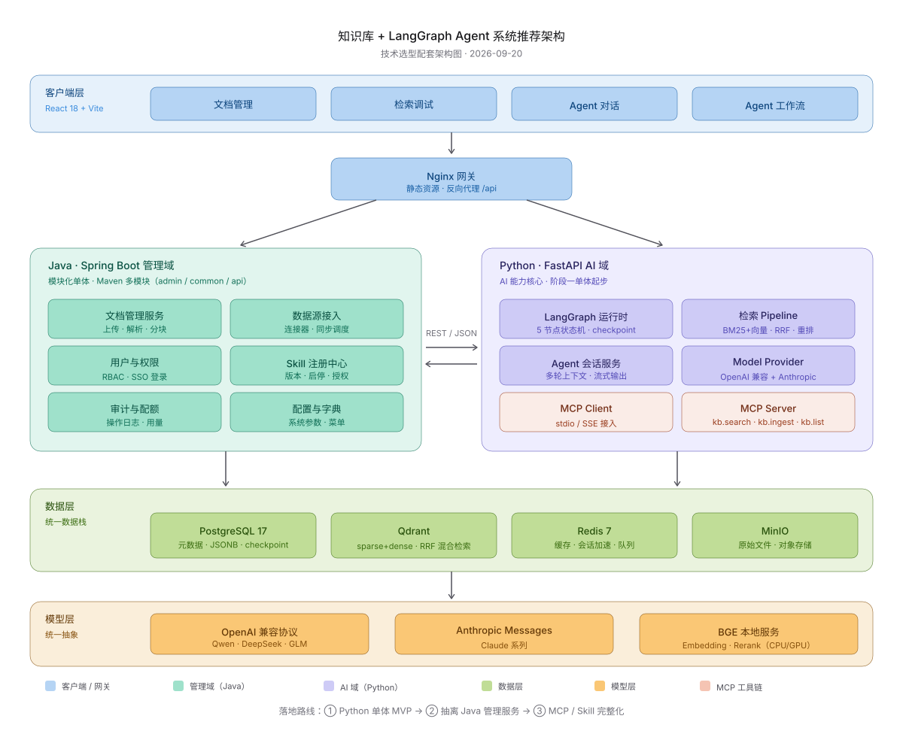

# 技术选型文档 —— 知识库 + LangGraph Agent 系统

> **版本**：v1.0 ｜ **日期**：2026-09-20 ｜ **状态**：已评审
> **范围**：语言 / AI 框架 / 管理系统形态 / 向量数据库 / 主数据库 / Skill 与 MCP / 落地路线
> **配套**：Pixso 设计稿（登录 → Agent 创建 → 工作台 ×8 页）｜ 架构图见 [技术架构图.svg](./技术架构图.svg)

---

## 1. 选型结论总览

| 决策点 | 结论 | 一句话理由 |
|---|---|---|
| 语言 | **Java + Python 双服务** | 管理域用 Java 主场技能，AI 域用生态垄断的 Python |
| AI 框架 | **LangGraph 骨架 + OpenAI 兼容协议 + Anthropic Provider** | 编排层与模型 API 层是两层东西，不冲突 |
| 管理系统形态 | **Spring Boot 模块化单体，不上 Spring Cloud** | 1 人 2 个服务，拆微服务纯负成本 |
| 向量数据库 | **Qdrant** | 原生 sparse+dense+RRF 混合检索，轻部署，已有实战经验 |
| 主数据库 | **PostgreSQL 17** | LangGraph 官方 checkpoint 后端 + JSONB + pgvector 生态位 |
| Skill / MCP | 知识库能力 MCP 工具化；Skill 由 Java 注册、Python 加载 | 与 MewCode 工具体系同一思路，简历可复用 |
| 中间件 | Redis + MinIO + Nginx | 缓存加速 / 原始文件 / 静态与反代 |

---

## 2. 总体架构



**请求流向**：React 管理台 → Nginx（静态资源 + `/api` 反向代理）→ 双服务：

- **Java · Spring Boot 管理域**：文档管理、数据源接入、用户权限、Skill 注册中心、审计配额——纯业务 CRUD 与治理；
- **Python · FastAPI AI 域**：LangGraph 运行时、检索 Pipeline、Agent 会话、Model Provider、MCP Client/Server——AI 能力核心；
- 两服务之间 **REST/JSON** 通信（AI 域需要文档元数据、Skill 定义时调 Java 域接口）；
- 数据层统一：PostgreSQL（元数据/JSONB 配置/checkpoint）、Qdrant（向量+混合检索）、Redis（缓存/会话加速）、MinIO（原始文件）；
- 模型层统一抽象：OpenAI 兼容协议（Qwen/DeepSeek/GLM）、Anthropic Messages、BGE 本地服务。

---

## 3. 语言选型：Java + Python 双服务

### 3.1 为什么不是纯 Java

LangGraph 没有官方 Java 版本；LangChain4j 生态远弱于 Python 侧（检索组件、Rerank、社区模板均缺）。选纯 Java 等于自断 AI 主线，与求职方向相悖。

### 3.2 为什么不是纯 Python

权限、文档管理、审核流、数据源连接器这些管理后台能力，恰好是 Spring Boot 的主场，也是在职工位（CSF 框架 + AIFGW 网关）的直接技能迁移。纯 Python 会浪费这块优势。

### 3.3 混合架构的真实成本与对策

双服务 = 两套部署、两套依赖、跨服务联调。对策是**分阶段演进**（详见第 10 章）：先用 Python 单体跑通 AI 链路，再抽离 Java 管理服务，避免一开始就背上双服务运维负担。

---

## 4. AI 框架：LangGraph + 多协议模型接入

### 4.1 先澄清层次：这不是二选一

| 层次 | 职责 | 本项目选择 |
|---|---|---|
| **编排层** | 决定先调谁、后调谁、怎么循环反思（流水线设计图） | LangGraph |
| **模型 API 层** | 真正生成文字的大脑（流水线上的工人） | OpenAI 兼容协议 + Anthropic Messages |

### 4.2 为什么 LangGraph 做骨架

- StateGraph + 条件边正好表达设计稿工作流页的 8 节点结构（意图路由 → 查询改写 → 混合检索 → 重排 → 生成 → 反思回环 ≤3 次）；
- 官方 PostgresSaver 提供生产级 checkpoint，支撑"暂停 / 重跑 / 断点续跑"（工作流页核心能力）；
- 法律 RAG Agent 项目（Recall@k 0.80）已验证过该技术栈，直接迁移。

### 4.3 模型接入：一套兼容协议 + 一个独立 Provider

- **OpenAI 兼容协议**统一接 Qwen / DeepSeek / GLM——国内主流模型全部兼容，换模型只改 `base_url` + `api_key`；
- **Anthropic Messages** 作为第二协议独立 Provider；
- 该设计与 MewCode 的多 SDK 适配层（`client.py` + `serialization.py`）同构，实现经验直接复用——**这是简历上"多协议适配能力"的第二个实证**。

### 4.4 Embedding / Rerank

BGE 系列本地服务（bge-m3 embedding + bge-reranker），与法律 RAG 项目的 BM25 + BGE 混合检索方案一脉相承，数据不出内网。

---

## 5. 管理系统：Spring Boot 模块化单体

### 5.1 为什么不上 Spring Cloud

Spring Cloud 解决的是"很多服务谁来管"（注册中心、熔断、网关路由）。本项目 1 人维护 2 个服务，引入 Nacos / Gateway / Sentinel 只有维护成本没有收益。**面试答法**："服务数量不支撑拆分成本，我用 Maven 多模块保持未来可拆性——模块化单体是当前规模的最优解。"

### 5.2 Maven 多模块划分

| 模块 | 职责 |
|---|---|
| `admin-web` | Controller 层 + 登录鉴权入口 |
| `admin-service` | 文档 / 数据源 / 权限 / Skill 注册 / 审计 业务逻辑 |
| `common` | 实体、DTO、工具类（与 AI 域共享的契约放 API 包） |
| `ai-api-client` | 暴露给 Python 侧的 REST 契约定义 |

---

## 6. 向量数据库：Qdrant（不选 Milvus）

| 维度 | Qdrant ✅ | Milvus |
|---|---|---|
| 部署 | 单容器，内存占用小 | etcd + MinIO + standalone，组件多、吃资源 |
| 混合检索 | **原生 sparse + dense 向量 + RRF 融合** | 需自行搭建方案 |
| 团队经验 | 法律 RAG 项目已实战 ✅ | 全新学习成本 |
| 适用规模 | 千万级向量以内 | 亿级、多副本生产集群 |

**关键理由**：Qdrant 原生 sparse vector + RRF 正好实现设计稿"检索调试"页的 BM25 + 向量策略切换——**一个数据库搞定混合检索，不需要额外挂 Elasticsearch**，架构更干净。本项目文档量级（百万级切片）远未触及 Qdrant 上限；如未来到亿级，迁移 Milvus 属于存储层替换，接口层隔离后成本可控。

---

## 7. 主数据库：PostgreSQL（为什么不是 MySQL）

MySQL 对纯 CRUD 管理后台完全够用，且与既有 Java 技术栈（MyBatis / RuoYi）最顺手。但本项目 **AI 域是主角**，PG 在四个生态位上全面占优：

| 维度 | PostgreSQL | MySQL |
|---|---|---|
| JSON 能力 | JSONB 可索引、可查内部字段（GIN） | JSON 能存，查询/索引能力弱 |
| 向量扩展 | pgvector 官方插件 | 无官方方案 |
| LangGraph checkpoint | **PostgresSaver 为官方生产级后端** | 需自研 |
| 中文全文检索 | tsvector + 中文分词插件 | 几乎不可用（按空格分词） |
| DDL 事务 | 可回滚，schema 迁移安全 | DDL 隐式提交 |

**三个具体落点**：

1. **Agent 动态配置用 JSONB**——工作流节点参数、Skill 包结构灵活多变，可直接按内部字段查询：
   ```sql
   SELECT * FROM agents WHERE config @> '{"tools": ["kb.search"]}';
   ```
2. **LangGraph checkpoint 官方标准后端就是 Postgres**（Redis 只做缓存加速层），社区模板全按 PG 写；
3. **pgvector 提供轻量向量兜底**——联调环境可不起 Qdrant。

**统一收益**：管理域 + AI 域连同一个 PG，避免"Java 连 MySQL、Python 连 PG"的双数据库心智负担。

---

## 8. Skill 与 MCP 设计

### 8.1 MCP：知识库能力工具化

AI 域内置 MCP Server，暴露三个工具，Agent 对话经 MCP Client 调用——知识库对 Agent 即"即插即用的工具"，与 MewCode 的 9 类工具体系同一思路：

| 工具 | 功能 | 对应设计稿 |
|---|---|---|
| `kb.search(query, top_k, strategy)` | 混合检索（BM25/向量/RRF 可选） | 检索调试页 |
| `kb.ingest(doc_id)` | 触发解析 → 分块 → 向量化入库 | 文档列表页 |
| `kb.list(filter)` | 列出知识库文档元数据 | 知识库概览页 |

### 8.2 Skill：提示词模板 + 工具组合包

- **定义**：一个 Skill = 特定 system prompt + 预挂载工具 + 输出格式约束（例："法律文书起草" = 法务 prompt + 自动挂 `kb.search` + 文书格式 schema）；
- **分工**：Java 管理域负责注册 / 版本 / 启停 / 授权（Skill 注册中心），Python 运行时按需加载执行；
- **对应设计稿**：Agent 创建页的"新建 Agent"即选择类型 + 挂载 Skill 的流程。

---

## 9. 数据层与中间件清单

| 组件 | 版本 | 用途 | 部署 |
|---|---|---|---|
| PostgreSQL | 17 | 元数据 / JSONB 配置 / LangGraph checkpoint / pgvector 兜底 | Docker 单容器 |
| Qdrant | ≥1.10 | 向量存储 + sparse/dense/RRF 混合检索 | Docker 单容器 |
| Redis | 7 | 缓存、会话加速、轻量队列 | Docker 单容器 |
| MinIO | 最新 | 原始文档对象存储 | Docker 单容器 |
| Nginx | stable | 静态资源 + `/api` 反向代理 | Docker 单容器 |

---

## 10. 三阶段落地路线

| 阶段 | 范围 | 交付物 | 验证标准 |
|---|---|---|---|
| **① Python 单体 MVP** | FastAPI 全包：检索 Pipeline + Agent 对话 + 简化文档上传；PG + Qdrant | 可演示的对话与检索闭环 | 检索 Recall@k ≥ 0.75；多轮对话带引用 |
| **② 抽离 Java 管理服务** | 文档 / 数据源 / 权限 / 审计迁至 Spring Boot；Nginx 组网 | 双服务架构 + React 管理台 | 设计稿 8 页功能全部走通 |
| **③ MCP / Skill 完整化** | MCP Server 工具化、Skill 注册与加载、Agent 工作流编排页能力 | Agent 平台闭环 | 工作流可拖拽配置并 checkpoint 重跑 |

**渐进原则**：每阶段都是可运行的完整系统，避免"大爆炸式"重构。

---

## 13. 风险与备选方案

| 风险 | 概率 | 应对 |
|---|---|---|
| 双服务联调成本超预期 | 中 | 阶段①保持单体；服务间契约先行（`ai-api-client`） |
| Qdrant 规模触顶 | 低 | 检索接口层隔离，按需迁 Milvus |
| LangGraph API 变动 | 中 | 锁定版本 + 薄封装层隔离 |
| 国内模型兼容性差异 | 低 | 兼容协议层做参数映射表（MewCode 序列化层经验） |

---

## 附 A：面试话术

> "选型上我做了三个明确取舍：一是 Java + Python 分域——管理域用 Spring Boot 承接企业级治理能力，AI 域用 FastAPI + LangGraph 承接生态；二是管理域坚持模块化单体不上 Spring Cloud，因为服务数量不支撑拆分成本，用 Maven 多模块保留可拆性；三是数据层选 Qdrant + PostgreSQL——Qdrant 原生 sparse/dense + RRF 一个库实现混合检索，PG 则因为 LangGraph 官方 checkpoint 后端和 JSONB 的 AI 生态位。整个方案每一步都建立在我做过的法律 RAG Agent 和 MewCode 多协议适配的实战经验上。"

## 附 B：与简历项目的衔接

| 简历项目 | 本项目复用点 |
|---|---|
| 法律 RAG Agent（Recall@k 0.80） | BM25 + BGE 混合检索、Parent-Child 分块、LangGraph 状态机 |
| MewCode（AI 编程助手） | 多 SDK 协议适配层 → Model Provider 设计；9 类工具 → MCP 工具化；文件式记忆 → checkpoint 方案 |
| 智能工厂 MES（Spring Boot） | 管理域 Spring Boot 工程实践直接迁移 |
